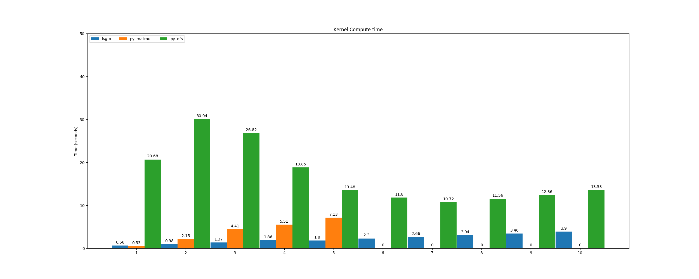

# FSGM
Implementation of an algorithm to quickly calculate string similarity Gram Kernel matrices.

## Background
Given a set of strings $S$ and an alphabet $A$, define the kernel function

$$
K_m(s_i, s_j) = \sum_{w:|w|=m} count(s_i, w)*count(s_j, w)
$$

Where $w$ is a word made from $A$ of length $m$ and $count(s_i, w)$ is the
number of occurences of the substring $w$ in $s_i$ with overlaps.

Then the Gram Kernel Matrix id defined as

$G^m_{ij} = K_m(s_i, s_j)$

This gets computationally very expensive as $m$ gets largers, since the search space $\{w \in A:|w|=m\}$ has $A^m$ elements. A very naive algorithm can take a huge amount of compute resoures, e.g.
```python
for i1, s1 in enumerate(S):
    for i2, s2 in enumerate(S):
        for w in length_m_words:
            kernel[i1, i2] += count(s1, w)*count(s2, w)
```

## Algortihmic details
This repository hosts an alogirthm for computing the exact matrix $G^m_{ij}$ in a faster set of steps. It is currently implemented in C++ with plans to expose a Python wrapper on top of it.

It makes use of the fact that for larger $m$, the probability that, for a given $w$, $count(s_i, w) > 0$ is $len(s_i)/|A|^m$, which gets smaller as $m$ increases. 
Secodly, it's clear that if $count(s, w) = 0$, then for any $a \in A$ we also have $count(s, w+a) = 0$. Thirdly $G$ is symmetric, so computing only the upper trainglur form is sufficient to compute all of $G$.

Using these details, the algorithm can perform _depth first search_ for every $s_i \in S$ for every individual character $a \in A$. That is, it creates the set
$$X_{i}^{a} = \{(w, count(s_i, w))\ |\ count(s_i, w) > 0,\ w\ starts\ with\ a,\ |w| = m\}$$
With DFS, words are built up starting from $a$ to words of length $m$. If at any point $count(s_i, w') = 0$ for $|w'| < m$, then all words with $w'$ as a prefix are ignored. 

While iterating through the input strings and fetching the $X$ sets above, it also caches a lookup map of _visited_ substrings $w$ of length $m$ where a non zero count was found, storing both the string index and the count, i.e

$$
V_w = \{(j, count(s_j, w))\ |\ count(s_j, w) > 0,  |w| = m \}
$$

Now the algorithm can be described as follows:

```python
for i, s in enumerate(input_strings):
    for a in alphabet:
        x_ia = depth_first_search(s, a, alphabet, m)
        for (word, countS) in x_ia:
            for (j, countJ) in lookup_cache[word]:
                K[i, j] += countS*countJ 
```  
Where `x_ia` is $X_{i}^{a}$, `lookup_cache` is $V$ and `K` is the upper triangular form for $G$.

Finally $G  = K + K^T - Diag(K)$. 

This works by taking advantage of the fact that $K$ is upper triangular, it only ever needs to compute $K[i, j]$ where $j < i$. Using this, it is certain that the lookup cache $V$ has all of the information required at each outer loop $s_i$, as it has already computed all non zero $count(s_j, w)$ with $j < i$ due to the ordering of the outer loop. 

## Other implementations
A less complicated algorithm makes use of matrix multiplication instead. Since $G$ is symmetric positive semi definite it can be written as $G = XX^T$, where $X_{ij} = count(s_i, w_j)$. A similar depth first search can be used here to find each entry making the algorithm also very quick.

The problem with this approach, is that as a matrix $X$ can be enormous, of size $(|S|, |A|^m)$ so very quickly the memory requirements become an obstacle, even though $G$ itself is only of size $(|S|, |S|)$. Sparse matrices can be used instead, however there will still be a point where performing matrix multiplication isn't possible anymore due to the size of $|A|^m$ as the memory requirements are just too great. Most libraries need to be able to allocate an array of length $|A|^m$ which gets extremely large. 

This issue is what has led to the algortihm in this repository. 

## Implementation

The algorithm detailed above is implemented in `src/kernelmatrix.cpp` in highly (un)optimized C++ with python bindings created as well.

## Benchmarks

In `bench/` there are two python implementations, one in `python_dfs.py` is the same algorithm explained above jus tin Python. The other in `python_matrix.py` is a more traditional algorithm using matrix multiplication - it uses sparse matrices and also uses DFS to find non zero entries in the matrix $X_ij = count(s_i, w_j)$. 

Using a dataset of 4198 molecules (found in bench.words.txt), with an alphabet of 33 characters, the FSGM algorithm was compared with the Python implementation of FSGM and the standard matrix multiplication method. This was carried out on an Intel Core i7 CPU (4 cores) with 8GB of RAM.

For values of $m$ larger than 5, the matrix multiplication method requested too much memory to complete, wheres both the C++ and Python FSGM implementations could compute the Kernel Matrix. 
The C++ implementation of FGSM was faster than both other algorithms, and a bar chart plot below shows the compute times for increasing values of $m$.



### Dependencies:
It requires the header files for [Eigen](https://eigen.tuxfamily.org/index.php?title=Main_Page) to be present in the include path.

It also requires [pybind11](https://github.com/pybind/pybind11) to be installed in order to create the Python wrapper function.

### Locally building the Python bindings

It can be built locally using 
```bash
c++ -O3 -Wall -shared -std=c++17 -fPIC $(python3 -m pybind11 --includes) src/*.cpp -o fsgm$(python3-config --extension-suffix)
```

Then in the same directory as the created `.so` file, it should be possible to open up python3 and import the function.

```bash
$ python3
Python 3.10.12 (main, Jun 11 2023, 05:26:28) [GCC 11.4.0] on linux
Type "help", "copyright", "credits" or "license" for more information.
>>> from fsgm import compute_kernel_matrix
```

The python function accepts two lists of strings (inputs, and the alphabet) and an integer for $m$, and returns a `numpy.ndarray`. 
